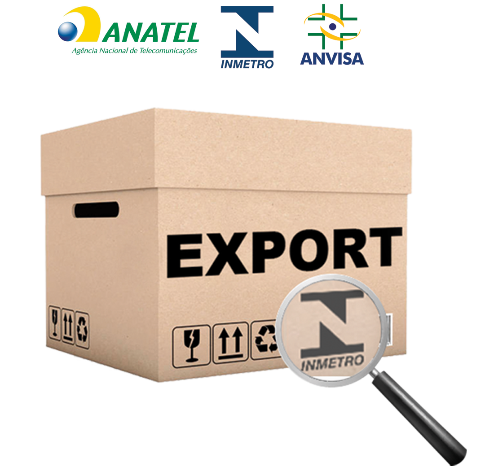

SOLUÇÕES: Certificações para produtos importados

A sua empresa precisa certificar um produto importado e não sabe por onde começar? A Apoema Comércio e Serviços LTDA, um dos segmentos do Grupo Ativa, oferece assessoria completa no processo de certificações de produtos importados. 
As soluções atendem desde o contato com o fabricante estrangeiro, passando por pesquisa, consulta e análise do produto, levantamento de custos operacionais, agendamentos de auditoria, preparação de amostras de mercadorias, encaminhamento de produtos aos laboratórios para emissão de laudos e certificados, solicitação de registros e homologações junto a órgãos nacionais como INMETRO, ANATEL e ANVISA, até a liberação do produto para a importação.

Conheça alguns escopos de produtos que já fazem parte do atendimento cotidiano da APOEMA:

- Artigos para festa;
- Artigos escolares;
- Brinquedos;
- Cosméticos;
- EPI’s;
- Eletrodomésticos e similares;
- Lâmpadas LED;
- Panelas metálicas;
- Módulos fotovoltácos e inversores, entre outros;

É possível contar com a expertise da APOEMA, especialista na gestão de certificações, para realizar a importação de modo simples, ágil e seguro, sem se preocupar com as etapas burocráticas do processo e evitando prejuízos e atrasos para o seu negócio.