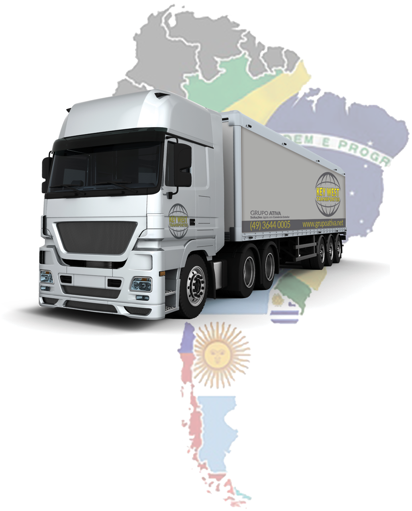

npm Key West Transportes

O transporte rodoviário de cargas é um desafio para muitas empresas. Seja pela complexidade que o produto exige em seu transporte, pelo prazo de entrega da mercadoria ao destino, ou até mesmo pela relação de confiança estabelecida com o operador logístico responsável. 

Especializada em transporte rodoviário nacional e internacional de cargas, a Key West Transportes entende que muitos negócios exigem um plano de transportes diferenciado para os seus produtos. Por isso, oferece soluções em operações logísticas, que são adaptáveis conforme a necessidade dos seus clientes e parceiros. Pontualidade na entrega, riqueza de informações e segurança, contribuem para a excelência operacional oferecida pela Key West. 

Conheça mais alguns diferenciais que a empresa possui:
-	Habilitação da Anvisa (Agência Nacional de Vigilância Sanitária) para transporte de produtos cosméticos;
-	Habilitação para operar em todos os portos alfandegados de fronteira e zonas secundárias nos países de atuação;
-	Permissão para trânsito aduaneiro (DTA);

Além de transportar cargas para todo o Brasil, a Key West também opera na Argentina, no Paraguai, no Uruguai, no Chile e no Peru. 

Possui frota moderna e variada. Dispõe de carretas e caminhões trucks, com carrocerias no modelo sider, aberta, com graneleira ou grade baixa, rebaixadas e com pranchas para atender cargas de medidas especiais. Também possui opções de veículos com baús secos ou frigorificados e porta container, para tráfego nacional e internacional, com trânsito de passagem pelo Brasil. Além disso, os caminhões são 100% rastreados e possuem uma ampla apólice de seguro para aumentar a segurança das cargas.

A gama de segmentos atendidos pela Key West é extensa. A empresa transporta variados tipos de mercadorias que variam desde produto alimentício e seus insumos, bebidas, máquinas e equipamentos, peças e auto peças, madeira e derivados, estruturas para shows e eventos de grande porte e uma infinidade de outros produtos.